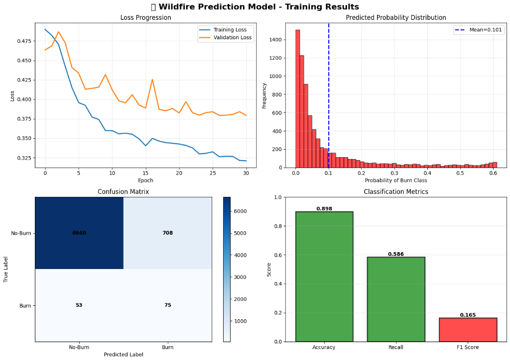

# 🔥 Alaska Wildfire Prediction - Research Project

[](https://www.python.org/downloads/)
[](https://www.tensorflow.org/)
[](LICENSE)
[](https://summerofcode.withgoogle.com/)

> **Hypothesis-driven research on wildfire drivers in Alaska using satellite imagery and weather data.**  
> Developed for [Google Summer of Code 2026](https://github.com/uaanchorage/GSoC) application with University of Alaska Anchorage.

---

## 📖 Overview

Alaska faces increasing wildfire risks due to climate change. This research project investigates wildfire drivers through hypothesis-driven analysis, testing scientific assumptions about what causes fires in boreal ecosystems. Under mentorship from [Dr. Yali Wang](https://github.com/YaliWang2019), the project shifted from architecture-driven development to evidence-based research, prioritizing scientific understanding over model performance.

---

## 🏆 Research Results

### ✅ Phase 1: Satellite-Based Detection (Complete)

**Research Question:** *Can deep learning detect wildfire patterns from satellite imagery despite extreme class imbalance?*



**Key Achievements:**
- **Recall:** 58.6% for wildfire detection (burn class)
- **Accuracy:** 89.8% overall classification
- **Model:** Enhanced CNN with residual blocks
- **Dataset:** 7,000+ patches from Alaska 2021 fire season
- **Challenge Solved:** Extreme class imbalance (1.7% positive samples)

> **Finding:** Spatial patterns in Sentinel-2 optical imagery contain detectable fire signatures. Viable for Alaska deployment.

---

### ✅ Phase 2: Weather Hypothesis Testing (Complete)

**Research Question:** *Do traditional fire weather variables (temperature, VPD, precipitation) correlate with Alaska wildfire ignition?*

**Key Finding: Alaska Fires Occur in LOW Traditional Fire-Risk Weather**

| Variable | Observed (Alaska Fires) | High Fire Risk Threshold | Assessment |
|----------|------------------------|-------------------------|------------|
| **VPD** | 0.70 kPa | > 1.0 kPa | **LOW** ❌ |
| **Precipitation** | 739 mm/month | < 50 mm/month | **WET** ❌ |
| **Temperature** | 15.7°C | > 25-30°C | **MODERATE** ❌ |

#### Correlation Analysis (511 Fire Patches)


#### Variable Distributions


#### VPD Distribution Analysis


**Scientific Implications:**
1. **Alaska fires are mechanistically different** from temperate/Mediterranean wildfires
2. **Weather alone is insufficient** for prediction in boreal ecosystems
3. **Alternative drivers likely:** Lightning strikes, temporal lag effects, boreal fuel structure
4. **Multi-modal approach validated:** Satellite imagery + weather context necessary

#### Phase 2 Visualizations (511 Fire Patches Analyzed)

<table>
<tr>
<td width="33%" align="center">
<b>Correlation Heatmap</b><br/>

</td>
<td width="33%" align="center">
<b>Variable Distributions</b><br/>

</td>
<td width="33%" align="center">
<b>VPD Distribution</b><br/>

</td>
</tr>
</table>

📊 **Full Analysis:** [docs/phase2-weather-analysis.md](docs/phase2-weather-analysis.md)

---

## 🔬 Methodology

### Phase 1: CNN Baseline
- **Data:** Sentinel-2 Level-2A optical imagery (June 2021)
- **Labels:** MTBS burn severity maps (Q3 2021)
- **Approach:** Address class imbalance via sample weighting (10× boost)
- **Innovation:** Tuned decision threshold (0.5 → 0.3) for safety-critical systems

### Phase 2: Weather Analysis
- **Data:** ERA5-Land hourly weather via Google Earth Engine
- **Temporal Window:** 30 days pre-fire (prevents data leakage)
- **Variables:** Temperature, Precipitation, Wind, Soil Moisture, **VPD**
- **Analysis:** 511 burn patches with dynamic time windows

---

## 🚀 Quick Start

**Full installation and usage guide:** [SETUP.md](SETUP.md)

```bash
# Clone repository
git clone https://github.com/farhann-saleem/Alaska-Wildfire-prediction-MVP.git
cd wildfire-prediction-mvp

# Install dependencies
python -m venv venv
source venv/bin/activate  # Windows: .\venv\Scripts\Activate.ps1
pip install -r requirements.txt

# Phase 1: Train detection model
python scripts/preprocess.py
python scripts/train_model.py

# Phase 2: Weather analysis (requires GEE authentication)
python scripts/era5_analysis.py
```

---

## 📁 Project Structure

```
wildfire-prediction-mvp/
├── docs/                       # Research documentation
│   ├── phase2-weather-analysis.md    # Phase 2 empirical findings
│   ├── debugging-journey.md          # Phase 1 technical challenges
│   └── ...
├── results/phase2/             # Phase 2 outputs
├── scripts/
│   ├── preprocess.py           # Phase 1 preprocessing
│   ├── train_model.py          # Phase 1 training
│   └── era5_analysis.py        # Phase 2 weather analysis
├── src/data_pipeline/          # Utilities
├── README.md                   # This file
├── SETUP.md                    # Installation & usage guide
├── ROADMAP.md                  # Research trajectory
└── requirements.txt            # Python dependencies
```

---

## 🔧 Engineering Challenges (Phase 1)

### Softmax Collapse
**Problem:** Model predicted "No Burn" for everything (98.3% accuracy, 0% recall)  
**Solution:** Sample weighting (10×), one-hot encoding, categorical cross-entropy

### Gradient Instability
**Problem:** Aggressive class weights caused training oscillation  
**Solution:** Reduced scaling (58× → 10×), lower learning rate (0.01 → 0.0001)

**Full Technical Details:** [docs/debugging-journey.md](docs/debugging-journey.md)

---

## 🗺️ Future Research Directions

Based on Phase 2 findings, proposed Phase 3 focuses on:

**Multi-Modal Integration:**
- **Sentinel-1 SAR:** All-weather vegetation stress detection
- **Lightning Data:** NOAA strike locations (direct ignition source)
- **Temporal Modeling:** 60-day fuel accumulation analysis (CNN-LSTM)

**Architecture:** Late fusion (preserve modality-specific signals)

**Contingent on:** GSoC 2026 acceptance

📍 **Full Trajectory:** [ROADMAP.md](ROADMAP.md)

---

## 📚 Documentation

- **[SETUP.md](SETUP.md)** - Installation and usage
- **[Phase 2 Analysis](docs/phase2-weather-analysis.md)** - Weather hypothesis testing
- **[Debugging Journey](docs/debugging-journey.md)** - Phase 1 technical challenges
- **[ROADMAP.md](ROADMAP.md)** - Research trajectory

---

## 🙏 Acknowledgments

- **[Dr. Yali Wang](https://github.com/YaliWang2019)** - Research mentorship and guidance toward hypothesis-driven approach
- **[University of Alaska Anchorage](https://www.uaa.alaska.edu/)** - Project support
- **[Google Summer of Code](https://summerofcode.withgoogle.com/)** - Program framework
- **[Sentinel-2 Mission](https://sentinel.esa.int/)** - Satellite imagery (ESA)
- **[MTBS Project](https://www.mtbs.gov/)** - Burn severity data (USGS/USFS)
- **[Copernicus ERA5](https://www.ecmwf.int/)** - Weather data (ECMWF)

**Related Work:**
- Wang, Y., et al. (2023). "Toward Energy-Efficient Deep Neural Networks for Forest Fire Detection in an Image." *The Geographical Bulletin*, 64(2), Article 13.

---

## 🤝 Contributing

This research project welcomes scientific collaboration. See [CONTRIBUTING.md](CONTRIBUTING.md) for guidelines.

---

## 📜 License

MIT License - see [LICENSE](LICENSE) file for details.

---

## 📧 Contact

**Developer:** Farhan Saleem  
**Repository:** [Alaska-Wildfire-prediction-MVP](https://github.com/farhann-saleem/Alaska-Wildfire-prediction-MVP)  
**GSoC Discussion:** [Alaska GSoC](https://github.com/uaanchorage/GSoC/discussions)

---

<p align="center">
  <i>🔥 Understanding wildfire drivers through hypothesis-driven research 🔥</i>
</p>
