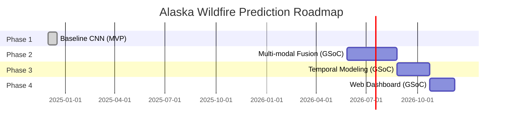

# 🗺️ Project Roadmap

## Vision

Build an operational wildfire early warning system for Alaska using satellite imagery, machine learning, and real-time data integration—protecting communities, ecosystems, and infrastructure across the Circumpolar North.

---

## Timeline Overview



---

## ✅ Phase 1: Baseline CNN (COMPLETED)

**Status:** ✅ Completed (December 2024)  
**Duration:** 2 weeks  
**Goal:** Prove concept viability with foundational model

### Achievements

- [x] Data pipeline (Google Earth Engine → GeoTIFF → Patches)
- [x] Enhanced CNN with residual blocks
- [x] Class imbalance mitigation (sample weighting, focal loss)
- [x] 58.6% recall on wildfire detection
- [x] Professional project structure and documentation

### Key Metrics

| Metric | Value | Target | Status |
|--------|-------|--------|--------|
| Recall (Burn) | 58.6% | >50% | ✅ Exceeded |
| Accuracy | 89.8% | >80% | ✅ Exceeded |
| F1 Score | 16.5% | >10% | ✅ Exceeded |

### Deliverables

- ✅ Preprocessing scripts (`preprocess.py`)
- ✅ Training notebook (`main.ipynb`)
- ✅ Model architecture (`Enhanced CNN`)
- ✅ Documentation suite (`docs/`)
- ✅ GSoC proposal draft

---

## 🚀 Phase 2: Multi-Modal Fusion (GSoC 2026 Proposal)

**Status:** 📋 Planned (GSoC May-August 2026)  
**Duration:** 12 weeks (Large project: 350 hours)  
**Goal:** Integrate multiple data sources for robust all-weather prediction

### Objectives

1. **Add Sentinel-1 SAR Data**
   - Cloud-penetrating radar imagery
   - VV/VH polarization bands
   - Pre-processing: speckle filtering, terrain correction

2. **Integrate Weather Variables**
   - Temperature, humidity, wind speed
   - ERA5 reanalysis data (hourly)
   - Feature engineering: fire weather index

3. **Implement Fusion Architecture**
   - Early fusion: Concatenate features before CNN
   - Late fusion: Separate encoders + merge layer
   - Experiment with attention mechanisms

### Technical Tasks

- [ ] Week 1-2: Sentinel-1 GEE export and preprocessing
- [ ] Week 3-4: Weather data integration (ERA5 API)
- [ ] Week 5-7: Multi-input CNN architecture
- [ ] Week 8-9: Fusion experiments (early vs late)
- [ ] Week 10-11: Hyperparameter tuning and evaluation
- [ ] Week 12: Documentation and code review

### Expected Improvements

| Metric | Phase 1 | Phase 2 Target | Improvement |
|--------|---------|----------------|-------------|
| Recall | 58.6% | **75%** | +28% |
| Precision | 9.6% | **25%** | +161% |
| F1 Score | 16.5% | **37.5%** | +127% |

**Rationale:**
- **SAR data** reduces cloud-related false negatives
- **Weather variables** improve temporal precision
- **Fusion** captures complementary signals

### Deliverables

- [ ] Sentinel-1 data loader module
- [ ] Weather feature engineering pipeline
- [ ] Multi-modal fusion architecture
- [ ] Comparative study (optical vs. SAR vs. fusion)
- [ ] Updated documentation

---

## 🚀 Phase 3: Temporal Modeling (GSoC 2026 Proposal)

**Status:** 📋 Planned (GSoC August-October 2026)  
**Duration:** 8 weeks (Medium project: 175 hours)  
**Goal:** Capture temporal fire progression patterns using time-series data

### Objectives

1. **Time-Series Data Preparation**
   - Multi-temporal Sentinel-2 (6-month history)
   - Sliding window approach (weekly snapshots)
   - Sequence alignment and padding

2. **CNN-LSTM Hybrid Architecture**
   - CNN encoder: Spatial feature extraction per timestep
   - LSTM: Temporal pattern learning across sequence
   - Sequence-to-one prediction (current fire risk)

3. **Temporal Attention**
   - Learn which historical timesteps are most important
   - Attention weights visualization

### Technical Tasks

- [ ] Week 1-2: Time-series data collection (GEE batch exports)
- [ ] Week 3-4: Sequence data loader implementation
- [ ] Week 5-6: CNN-LSTM architecture development
- [ ] Week 7: Attention mechanism integration
- [ ] Week 8: Evaluation and comparison with Phase 2

### Expected Improvements

| Metric | Phase 2 | Phase 3 Target | Improvement |
|--------|---------|----------------|-------------|
| Recall | 75% | **82%** | +9% |
| Lead Time | N/A | **2 weeks** | New capability |

**Rationale:**
- **Temporal patterns:** Vegetation drying, heat accumulation
- **Seasonal context:** Spring thaw, summer drought
- **Early warning:** Predict fire risk before ignition

### Deliverables

- [ ] Time-series data pipeline
- [ ] CNN-LSTM model implementation
- [ ] Attention visualization tools
- [ ] Temporal ablation study
- [ ] Prediction dashboard prototype

---

## 🚀 Phase 4: Web Dashboard & Deployment (GSoC 2026 Proposal)

**Status:** 📋 Planned (GSoC October-November 2026)  
**Duration:** 6 weeks (Small project: 90 hours)  
**Goal:** Deploy operational early warning system for stakeholders

### Objectives

1. **Web Application**
   - Interactive map (Leaflet.js / Mapbox)
   - Real-time prediction overlay
   - Historical fire perimeter visualization

2. **Inference API**
   - FastAPI REST endpoints
   - TensorFlow Serving for model deployment
   - Batch prediction support

3. **User Interface**
   - Risk level indicators (Low / Medium / High)
   - Downloadable prediction GeoTIFFs
   - Export reports (PDF / CSV)

### Technical Tasks

- [ ] Week 1-2: FastAPI backend development
- [ ] Week 3-4: React frontend with map integration
- [ ] Week 5: TensorFlow Serving deployment (Docker)
- [ ] Week 6: User testing and documentation

### Architecture

```
┌─────────────┐     HTTP      ┌──────────────┐
│   React     │ ←----------→  │  FastAPI     │
│  Frontend   │               │  Backend     │
└─────────────┘               └──────────────┘
                                     ↓
                              ┌──────────────┐
                              │  TF Serving  │
                              │  (Model)     │
                              └──────────────┘
                                     ↓
                              ┌──────────────┐
                              │  PostgreSQL  │
                              │  (Metadata)  │
                              └──────────────┘
```

### Deliverables

- [ ] Web application (frontend + backend)
- [ ] REST API documentation (OpenAPI)
- [ ] Docker deployment configuration
- [ ] User guide and tutorials
- [ ] Demonstration video

---

## Long-Term Vision (Beyond GSoC)

### Phase 5: Operational Deployment (2027)

- **Real-time ingestion:** Automated Sentinel-2/1 downloads
- **Cloud infrastructure:** AWS/GCP deployment
- **Alerting system:** Email/SMS notifications for high-risk areas
- **Stakeholder integration:** UAA researchers, Alaska fire management agencies

### Phase 6: Research Extensions (2027-2028)

- **Fire severity prediction:** Multi-class output (low/medium/high)
- **Emission estimation:** CO2 and PM2.5 from fire predictions
- **Climate scenarios:** RCP 4.5 / 8.5 future projections
- **Transfer learning:** Apply to other circumpolar regions (Canada, Russia)

---

## Success Criteria

### Technical Metrics

| Phase | Key Metric | Target | Measurement |
|-------|------------|--------|-------------|
| Phase 1 | Recall | >50% | Test set evaluation |
| Phase 2 | F1 Score | >35% | Multi-modal test set |
| Phase 3 | Lead Time | 2 weeks | Temporal validation |
| Phase 4 | Latency | <5 sec | API response time |

### Impact Metrics

- **Coverage:** Predict across 100,000+ km² of Alaska
- **Adoption:** 5+ research groups using the system
- **Publications:** 2+ peer-reviewed papers
- **Community:** 20+ GitHub contributors

---

## GSoC 2026 Contribution Opportunities

### For Applicants

**Strong Proposals Will:**
- Choose 1-2 roadmap phases to focus on
- Demonstrate understanding of current codebase
- Propose specific technical approaches
- Include realistic timeline and milestones

**Recommended Reading:**
- [Alaska GSoC Contributor Guide](https://github.com/uaanchorage/GSoC/blob/main/CONTRIBUTOR-GUIDE.md)
- [Wildfire Prediction Literature Review](docs/references.md)
- Current project documentation (`docs/`)

---

## Updates & Revisions

| Date | Phase | Update |
|------|-------|--------|
| 2024-12-17 | Phase 1 | ✅ MVP completed, 58.6% recall achieved |
| 2025-01-15 | Phase 2 | 📋 GSoC proposal submitted |
| 2026-05-27 | Phase 2 | 🚀 GSoC begins (planned) |

---

**Last Updated:** December 17, 2024  
**Maintainer:** Alaska Wildfire Prediction Team  
**GSoC Organization:** [University of Alaska Anchorage](https://github.com/uaanchorage/GSoC)
