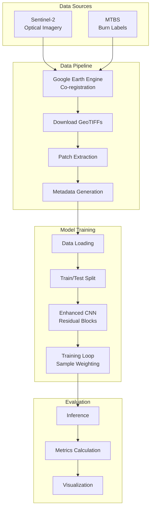
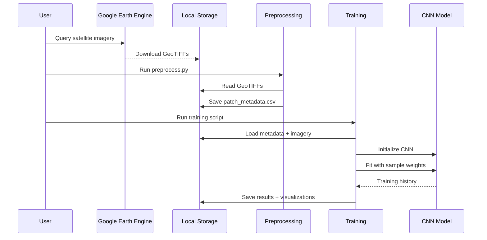

# System Architecture

## Overview

The Alaska Wildfire Prediction system is designed as a modular machine learning pipeline that processes satellite imagery to predict wildfire occurrence. The architecture follows a clear separation of concerns with distinct stages for data acquisition, preprocessing, model training, and evaluation.

## High-Level Architecture



## Component Architecture

### 1. Data Acquisition Layer

**Purpose:** Obtain and align satellite imagery with ground truth labels

**Components:**
- **Google Earth Engine Script** (`scripts/export_data_gee.js`)
  - Queries Sentinel-2 Level-2A imagery for specified date ranges
  - Filters by region (Alaska) and cloud cover
  - Downloads MTBS burn severity maps
  - Ensures spatial alignment (same CRS, resolution, extent)
  - Exports co-registered GeoTIFFs

**Inputs:**
- Date range (e.g., June 2021 for pre-fire imagery)
- Geographic bounds (Alaska region)
- Cloud cover threshold

**Outputs:**
- `s2_2021_06_input_10m.tif` - Sentinel-2 RGB bands (10m resolution)
- `burn_2021_Q3_label_10m.tif` - Binary burn mask (10m resolution)

---

### 2. Data Preprocessing Layer

**Purpose:** Transform raw GeoTIFF imagery into ML-ready patch datasets

**Components:**

#### **Patch Extraction** (`scripts/preprocess.py`)

**Process:**
1. Load GeoTIFF files using `rasterio`
2. Verify spatial alignment (CRS, dimensions)
3. Sliding window extraction (64×64 pixels, non-overlapping)
4. Label derivation (binary: any burned pixel → label=1)
5. Metadata generation (patch ID, coordinates, dates)

**Key Features:**
- Alignment verification prevents data corruption
- Center coordinate tracking for spatial analysis
- Efficient in-memory processing for large files

**Outputs:**
- `data/patch_metadata.csv` - Structured metadata
  ```
  patch_id, center_x, center_y, input_date, fire_outcome_date, burn_label
  ```

---

### 3. Model Training Layer

**Purpose:** Train deep learning models to predict wildfire occurrence

#### **Data Loading** (`scripts/main.ipynb`, `scripts/train_model.py`)

**Process:**
1. Read patch metadata CSV
2. Load full GeoTIFF into memory
3. Extract patches at specified coordinates
4. Normalize pixel values (÷10,000 for Sentinel-2 reflectance)
5. Skip patches with NaN values
6. Stratified train-test split (75/25)

**Memory Optimization:**
- Single-pass GeoTIFF loading
- NumPy array operations
- Efficient patch indexing

#### **Model Architecture**

**Enhanced CNN with Residual Blocks:**

```
Input (64×64×3 RGB)
    ↓
Conv2D(32, 5×5) + ReLU
    ↓
MaxPool(2×2) → 32×32
    ↓
Residual Block 1 (32 filters)
├─ Conv2D(32, 3×3) + ReLU
├─ Conv2D(32, 3×3)
├─ Conv2D(32, 1×1) [skip connection]
└─ Add + ReLU
    ↓
MaxPool(2×2) → 16×16
    ↓
Residual Block 2 (64 filters)
├─ Conv2D(64, 3×3) + ReLU
├─ Conv2D(64, 3×3)
├─ Conv2D(64, 1×1) [skip connection]
└─ Add + ReLU
    ↓
MaxPool(2×2) → 8×8
    ↓
Flatten
    ↓
Dropout(0.4)
    ↓
Dense(128) + ReLU
    ↓
Dropout(0.2)
    ↓
Dense(2) + Softmax
    ↓
Output [P(No-Burn), P(Burn)]
```

**Residual Block Design:**
- Skip connections prevent gradient vanishing
- Enables deeper network training
- Improves feature learning

#### **Training Strategy**

**Class Imbalance Mitigation:**
- **Problem:** 98.3% no-burn, 1.7% burn (58:1 ratio)
- **Solution 1:** Sample weighting (10× boost for burn class)
- **Solution 2:** Focal loss (optional alternative)
- **Solution 3:** Stratified splitting

**Training Configuration:**
```yaml
optimizer: Adam (lr=0.0001)
loss: categorical_crossentropy
batch_size: 32
epochs: 50
callbacks:
  - EarlyStopping (patience=4, monitor=val_loss)
  - ReduceLROnPlateau (factor=0.5, patience=2)
```

**Regularization:**
- Dropout layers (0.4, 0.2)
- Early stopping
- Learning rate reduction on plateau

---

### 4. Evaluation Layer

**Purpose:** Assess model performance and generate insights

**Metrics:**
- **Accuracy:** Overall classification correctness
- **Recall (Sensitivity):** True positive rate for burn class (critical for early warning)
- **F1 Score:** Harmonic mean of precision and recall
- **Confusion Matrix:** Breakdown of predictions

**Visualizations:**
1. **Loss Curves:** Training/validation loss progression
2. **Probability Distribution:** Model confidence analysis
3. **Confusion Matrix:** Classification breakdown
4. **Metrics Bar Chart:** Performance comparison

**Example Output:**
```
Accuracy:  0.898
Recall:    0.586  ← Key metric for wildfire detection
F1 Score:  0.165
```

---

## Data Flow Diagram



---

## Technology Stack

### Core Dependencies

| Component | Technology | Purpose |
|-----------|-----------|---------|
| **Data Processing** | NumPy, Pandas | Numerical operations, metadata |
| **Geospatial** | Rasterio | GeoTIFF reading/writing |
| **Deep Learning** | TensorFlow 2.x, Keras | Model training |
| **Visualization** | Matplotlib, Seaborn | Result plotting |
| **ML Utilities** | scikit-learn | Train/test split, metrics |

### Data Formats

- **Imagery:** GeoTIFF (Cloud Optimized)
- **Metadata:** CSV (UTF-8)
- **Model Weights:** HDF5 (Keras format)
- **Configuration:** YAML

---

## Scalability Considerations

### Current Limitations (Phase 1 MVP)
- In-memory data loading (requires 8GB+ RAM)
- Single-node training (no distributed computing)
- Binary classification only (no severity levels)
- Static imagery (no temporal sequences)

### Future Enhancements (Proposed for GSoC)

**Phase 2: Multi-modal Fusion**
- Add data loaders for Sentinel-1 (SAR) and weather data
- Implement multi-input CNN architecture
- Feature-level fusion strategy

**Phase 3: Temporal Modeling**
- Sliding window time-series loader
- CNN-LSTM hybrid architecture
- Sequence padding and masking

**Phase 4: Deployment**
- Cloud-based inference API (FastAPI)
- Model versioning and A/B testing
- Real-time data ingestion pipeline

---

## Design Principles

1. **Modularity:** Clear separation between data, model, and evaluation
2. **Reproducibility:** Fixed random seeds, versioned dependencies
3. **Extensibility:** Easy to add new data sources or model architectures
4. **Safety:** Alignment verification prevents data corruption
5. **Efficiency:** Single-pass GeoTIFF loading, NumPy vectorization

---

## References

- [Sentinel-2 Technical Guide](https://sentinel.esa.int/web/sentinel/technical-guides/sentinel-2-msi)
- [MTBS Data Dictionary](https://www.mtbs.gov/direct-download)
- [TensorFlow Best Practices](https://www.tensorflow.org/guide/keras/sequential_model)
