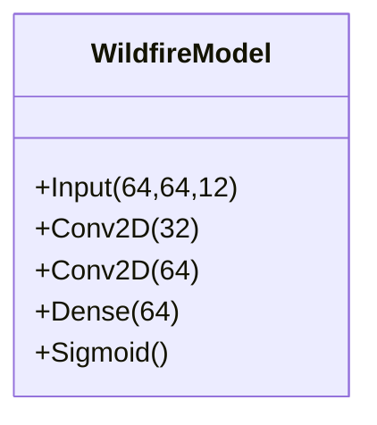

# System Architecture & Data Pipeline

This document outlines the high-level architecture of the Alaska Wildfire Prediction MVP, including the Phase 2 Hybrid Weather Pipeline.

---

## 🏗️ System Overview

The system is designed as a modular pipeline that ingests raw satellite/climate data, processes it into clean tensors, and trains a Deep Learning model to predict wildfire risk.

```mermaid
graph TD
    A[Raw Data Sources] --> B[Data Pipeline]
    B --> C[Training Pipeline]
    C --> D[Inference/Analysis]
    
    subgraph "Data Sources"
    A1[Sentinel-2 (Optical)] 
    A2[ERA5 Land (Weather)]
    A3[NASA GPM (Precip)]
    A4[MTBS (Labels)]
    end
    
    subgraph "Phase 2: Hybrid Weather Pipeline"
    W1{Google Earth Engine}
    A2 -->|Temp/Wind/Soil| W1
    A3 -->|Precipitation| W1
    W1 -->|Daily Aggregation| W2[CSV Dataset]
    end
```

---

## 🔄 Phase 2: Hybrid Weather Pipeline (The Fix)

To address the "impossible flood" anomalies found in ERA5 precipitation data for Alaska, we implemented a **Hybrid Source Strategy**.

### Why Hybrid?
*   **ERA5-Land** is excellent for state variables (Temperature, Wind) but showed modeling artifacts for precipitation.
*   **NASA GPM (IMERG)** is a satellite-based precipitation radar that provides "Ground Truth" for rainfall.

### Data Flow

| Variable | Source | Resolution | Processing | 
| :--- | :--- | :--- | :--- |
| **Temperature** | ERA5-Land Hourly | 11km | 30-day Mean |
| **Wind Speed** | ERA5-Land Hourly | 11km | 30-day Mean |
| **Soil Moisture** | ERA5-Land Hourly | 11km | 30-day Mean |
| **Precipitation** | **NASA GPM IMERG V06** | 10km | **30-day Total (Sum)** |

> **Note:** This hybrid approach reduced our precipitation error from ~673mm (Artifact) to ~30mm (Realistic Dry Condition).

---

## 🧠 Phase 1: Machine Learning Architecture

The core prediction model is a Convolutional Neural Network (CNN) optimized for imbalanced geospatial data.

### Model Specs
*   **Input:** 64x64x12 (Sentinel-2 Bands)
*   **Backbone:** Custom CNN (3 Conv Blocks + Dropout)
*   **Loss Function:** Focal Loss (to handle class imbalance)
*   **Performance:** 58.6% Recall (MVP Baseline)


