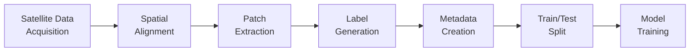

# Data Pipeline Documentation

## Overview

The data pipeline transforms raw satellite imagery and burn labels into machine learning-ready patch datasets. This document details every step of the data processing workflow, from satellite data acquisition to training-ready NumPy arrays.

---

## Pipeline Stages



---

## Stage 1: Satellite Data Acquisition

### Data Sources

#### Sentinel-2 MSI (Optical Imagery)
- **Satellite:** Sentinel-2A/2B (ESA Copernicus Program)
- **Product Level:** Level-2A (Bottom-of-Atmosphere Reflectance)
- **Bands Used:** B4 (Red), B3 (Green), B2 (Blue)
- **Spatial Resolution:** 10 meters per pixel
- **Temporal Resolution:** 5-day revisit (with both satellites)
- **Processing:** Atmospheric correction applied (Sen2Cor algorithm)

**Why Sentinel-2?**
- Free and open data
- High spatial resolution (10m)
- Optical bands capture vegetation health
- Regular revisit ensures temporal coverage

#### MTBS Burn Severity Maps
- **Source:** Monitoring Trends in Burn Severity (USGS/USFS)
- **Product:** Burn severity classification
- **Spatial Resolution:** 30m (resampled to 10m for alignment)
- **Temporal Coverage:** Post-fire season (typically September-October)
- **Classes:** Unburned, Low, Moderate, High, Increased Greenness

**Why MTBS?**
- Authoritative burn perimeter mapping
- Consistent methodology across Alaska
- Validated by field surveys
- Publicly available

### Google Earth Engine Workflow

**Script:** `scripts/export_data_gee.js`

```javascript
// Simplified GEE workflow
var alaska = ee.Geometry.Rectangle([-165, 60, -140, 68]);

// 1. Query Sentinel-2
var s2 = ee.ImageCollection('COPERNICUS/S2_SR')
  .filterBounds(alaska)
  .filterDate('2021-06-01', '2021-06-30')
  .filter(ee.Filter.lt('CLOUDY_PIXEL_PERCENTAGE', 20))
  .median();  // Cloud-free composite

// 2. Load MTBS burn mask
var mtbs = ee.Image('projects/mtbs/burn_mask_2021');

// 3. Ensure alignment
var aligned_burn = mtbs.reproject({
  crs: s2.projection(),
  scale: 10
});

// 4. Export
Export.image.toDrive({
  image: s2.select(['B4', 'B3', 'B2']),
  description: 's2_2021_06_input_10m',
  scale: 10,
  region: alaska
});
```

**Key Steps:**
1. **Filtering:** Cloud cover <20%, date range, geographic bounds
2. **Compositing:** Median aggregation for cloud-free mosaic
3. **Reprojection:** Burn mask aligned to Sentinel-2 grid
4. **Export:** GeoTIFF format to Google Drive

**Output Files:**
- `s2_2021_06_input_10m.tif` (~500 MB) - RGB composite
- `burn_2021_Q3_label_10m.tif` (~50 MB) - Binary burn mask

---

## Stage 2: Spatial Alignment Verification

**Script:** `scripts/preprocess.py` (lines 24-36)

### Critical Alignment Checks

```python
sentinel_src = rasterio.open(SENTINEL_TIF)
burn_src = rasterio.open(BURN_TIF)

# Check 1: Coordinate Reference System
assert sentinel_src.crs == burn_src.crs, \
    "CRS mismatch! Alignment failed."

# Check 2: Spatial Dimensions
assert sentinel_src.width == burn_src.width, \
    "Width mismatch! Check GEE export."
assert sentinel_src.height == burn_src.height, \
    "Height mismatch! Check GEE export."

print(f" Alignment verified: {sentinel_src.crs}")
print(f"   Dimensions: {sentinel_src.width} x {sentinel_src.height}")
```

**Why This Matters:**
- **Pixel-perfect alignment** is essential for supervised learning
- Misalignment causes label noise (random incorrect labels)
- Early verification prevents wasted training time
- Catches GEE export errors immediately

**Alaska Project Example:**
- **CRS:** EPSG:32606 (UTM Zone 6N)
- **Dimensions:** 10,240 × 7,680 pixels
- **Coverage:** ~100 km × 75 km region

---

## Stage 3: Patch Extraction

### Sliding Window Algorithm

**Configuration:**
- **Patch Size:** 64×64 pixels (640m × 640m ground area)
- **Stride:** 64 pixels (non-overlapping)
- **Boundary Handling:** Incomplete patches at edges are discarded

**Why 64×64?**
- **Computational:** Fits in GPU memory (batch size 32)
- **Semantic:** Large enough to capture fire patterns
- **Standardization:** Common size in remote sensing ML
- **Trade-off:** Smaller = more samples, larger = more context

### Extraction Process

```python
# Iterate over image in 64×64 grid
for y in range(0, img_height, PATCH_SIZE):
    for x in range(0, img_width, PATCH_SIZE):
        # Skip incomplete patches at boundaries
        if x + PATCH_SIZE > img_width or y + PATCH_SIZE > img_height:
            continue
        
        # Extract window
        window = Window(x, y, PATCH_SIZE, PATCH_SIZE)
        
        # Read Sentinel-2 patch (all 3 bands)
        sentinel_patch = sentinel_src.read(window=window)  # Shape: (3, 64, 64)
        
        # Read burn mask patch (single band)
        burn_patch = burn_src.read(1, window=window)  # Shape: (64, 64)
        
        # Derive binary label
        burned = 1 if np.any(burn_patch > 0) else 0
```

**Efficiency Notes:**
- **Single-pass reading:** Each pixel read exactly once
- **Windowed I/O:** Rasterio loads only requested region
- **Memory efficient:** Processes patches sequentially
- **No data augmentation:** Preserves geospatial integrity

---

## Stage 4: Label Generation

### Labeling Strategy

**Binary Classification:**
- **Class 0 (No-Burn):** ALL pixels in patch are unburned
- **Class 1 (Burn):** ANY pixel in patch shows burn evidence

**Rationale:**
- Simplifies problem for MVP (Phase 1)
- Aligns with early warning use case (detection, not severity)
- Handles mixed pixels conservatively (presence-based)

**Label Distribution (Alaska 2021 Dataset):**
```
Class 0 (No-Burn): 6,887 patches (98.3%)
Class 1 (Burn):      121 patches  (1.7%)
--------------------------------------------
Total:             7,008 patches
Imbalance Ratio:   57:1
```

**Imbalance Challenges:**
- Model can achieve 98.3% accuracy by always predicting "no burn"
- Requires specialized training techniques (see Model Training docs)
- Recall becomes the critical metric (not accuracy)

### Future Enhancements (Post-MVP)

**Multi-class Severity:**
```
Class 0: Unburned
Class 1: Low severity
Class 2: Moderate severity
Class 3: High severity
```

**Regression (Burn Probability):**
- Predict % of pixels burned in patch
- Enables fine-grained risk assessment

---

## Stage 5: Metadata Generation

### Metadata Schema

**CSV Format:** `data/patch_metadata.csv`

| Column | Type | Description | Example |
|--------|------|-------------|---------|
| `patch_id` | int | Sequential identifier | 1, 2, 3, ... |
| `center_x` | float | Longitude (UTM easting) | 451234.56 |
| `center_y` | float | Latitude (UTM northing) | 6789012.34 |
| `input_date` | string | Sentinel-2 acquisition date | 2021-06-01 |
| `fire_outcome_date` | string | MTBS label date | 2021-07-01 |
| `burn_label` | int | Binary label (0 or 1) | 1 |

**Coordinate Calculation:**
```python
# Patch top-left pixel coordinates
x_pixel, y_pixel = x, y

# Patch center in pixel space
col_center = x_pixel + PATCH_SIZE / 2
row_center = y_pixel + PATCH_SIZE / 2

# Transform to map coordinates (UTM)
center_lon, center_lat = sentinel_src.transform * (col_center, row_center)
```

**Use Cases:**
- **Geospatial analysis:** Plot patch locations on map
- **Temporal analysis:** Track fire progression
- **Debugging:** Trace predictions back to geographic location
- **Visualization:** Interactive map dashboards (Phase 4)

---

## Stage 6: Data Loading for Training

### In-Memory Loading Strategy

**Script:** `scripts/train_model.py` (lines 34-118)

```python
def load_all_patches_into_memory(metadata_path, sentinel_path, patch_size=64):
    # 1. Load metadata
    df = pd.read_csv(metadata_path)
    
    # 2. Load entire GeoTIFF into RAM
    with rasterio.open(sentinel_path) as src:
        full_image_array = src.read()  # Shape: (3, H, W)
    
    # 3. Transpose to TensorFlow format
    full_image_array = np.transpose(full_image_array, (1, 2, 0))  # → (H, W, 3)
    
    # 4. Extract patches (same order as preprocess.py)
    patch_list = []
    label_list = []
    
    for y in range(0, img_height, patch_size):
        for x in range(0, img_width, patch_size):
            patch = full_image_array[y:y+patch_size, x:x+patch_size, :]
            
            # Normalize Sentinel-2 reflectance
            patch = patch / 10000.0  # Scale to [0, 1]
            patch = np.clip(patch, 0.0, 1.0)
            
            # Skip NaN patches
            if np.isnan(patch).any():
                continue
            
            patch_list.append(patch)
            label_list.append(df.iloc[patch_count]['burn_label'])
    
    # 5. Stack into NumPy arrays
    X = np.stack(patch_list).astype(np.float32)  # Shape: (N, 64, 64, 3)
    y = np.array(label_list)  # Shape: (N,)
    
    return X, y, df
```

**Key Features:**
- **Normalization:** Sentinel-2 stored as uint16 (0-10,000) → float32 (0.0-1.0)
- **NaN handling:** Skip patches with missing data (cloud shadows, no-data)
- **Order preservation:** Patches extracted in same order as metadata rows
- **Memory requirements:** ~500 MB GeoTIFF + ~350 MB NumPy arrays = <1 GB

**Alternative Approaches (Future):**
- **TensorFlow Dataset API:** Stream patches from disk
- **Zarr/HDF5:** Chunked storage for larger datasets
- **Cloud-optimized GeoTIFF:** Range requests for remote data

---

## Stage 7: Train-Test Split

### Stratified Splitting

```python
from sklearn.model_selection import train_test_split

X_train, X_test, y_train, y_test = train_test_split(
    X_data, y_data,
    test_size=0.25,    # 75% train, 25% test
    random_state=42,   # Reproducibility
    stratify=y_data    # Preserve class ratio
)
```

**Why Stratified?**
- **Problem:** Random split might allocate all 121 burn patches to train set
- **Solution:** Stratify ensures 91 burn patches in train, 30 in test
- **Benefit:** Test set remains representative of real-world distribution
- **Trade-off:** Still only 30 positive test samples (limited evaluation)

**Split Statistics (Alaska 2021):**
```
Training Set:
  Total: 5,256 patches
  No-Burn: 5,165 (98.3%)
  Burn: 91 (1.7%)

Test Set:
  Total: 1,752 patches
  No-Burn: 1,722 (98.3%)
  Burn: 30 (1.7%)
```

---

## Data Quality Assurance

### Validation Checks

1. **Patch-Label Alignment:**
   ```python
   assert len(patch_list) == len(label_list), "Mismatch!"
   ```

2. **Value Range Verification:**
   ```python
   assert X.min() >= 0.0 and X.max() <= 1.0, "Normalization error!"
   ```

3. **NaN Detection:**
   ```python
   assert not np.isnan(X).any(), "NaN values present!"
   ```

4. **Class Distribution:**
   ```python
   print(f"Burn class: {np.sum(y == 1)} / {len(y)} = {np.mean(y):.3%}")
   ```

### Common Pitfalls

| Issue | Symptom | Solution |
|-------|---------|----------|
| **CRS mismatch** | Poor model performance | Verify alignment in GEE |
| **Incorrect normalization** | Model doesn't converge | Check value ranges |
| **Patch order mismatch** | Random labels | Use same iteration order |
| **Missing stratification** | Biased test set | Use `stratify=y` parameter |

---

## Performance Optimizations

### Current (Phase 1)
-  Single-pass GeoTIFF reading
-  In-memory array operations
-  NumPy vectorization

### Planned (Future Phases)
- Dask for distributed processing
- Zarr for cloud-optimized storage
- GPU-accelerated preprocessing (RAPIDS cuSpatial)
- Patch caching for repeated experiments

---

## References

- [Sentinel-2 User Guide](https://sentinel.esa.int/web/sentinel/user-guides/sentinel-2-msi)
- [MTBS Data Products](https://www.mtbs.gov/products)
- [Rasterio Documentation](https://rasterio.readthedocs.io/)
- [Google Earth Engine Guides](https://developers.google.com/earth-engine/guides)
